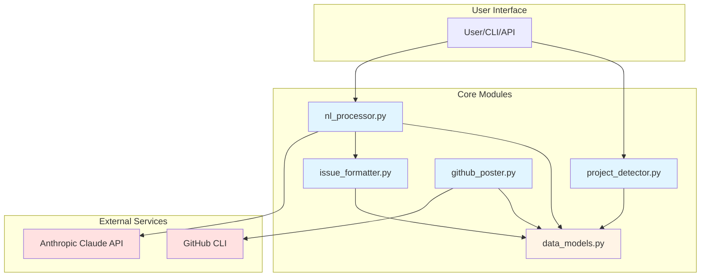
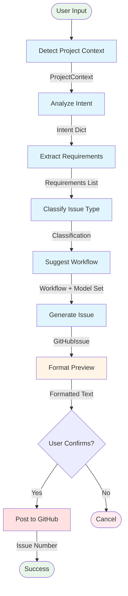
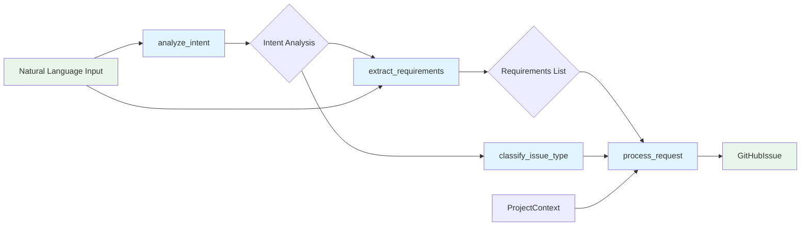
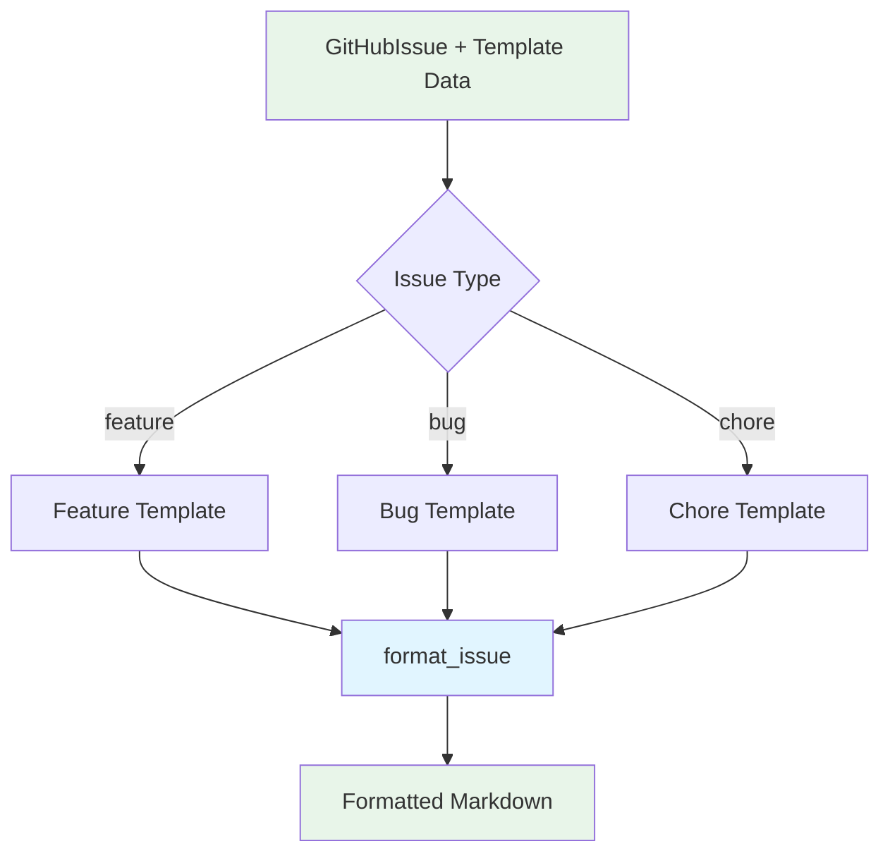
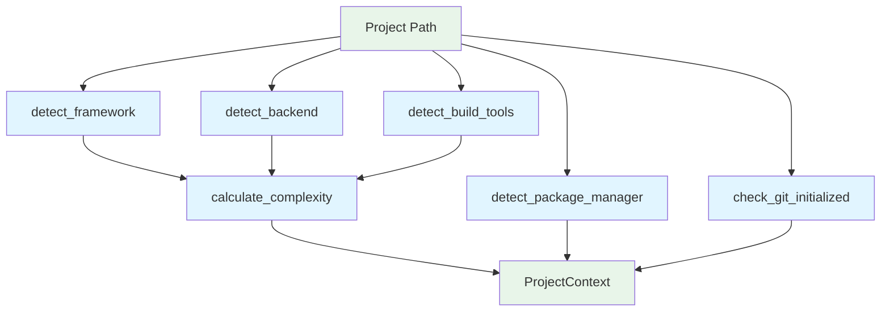
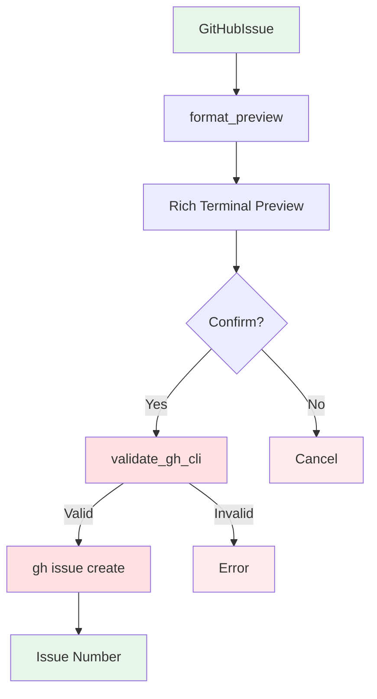
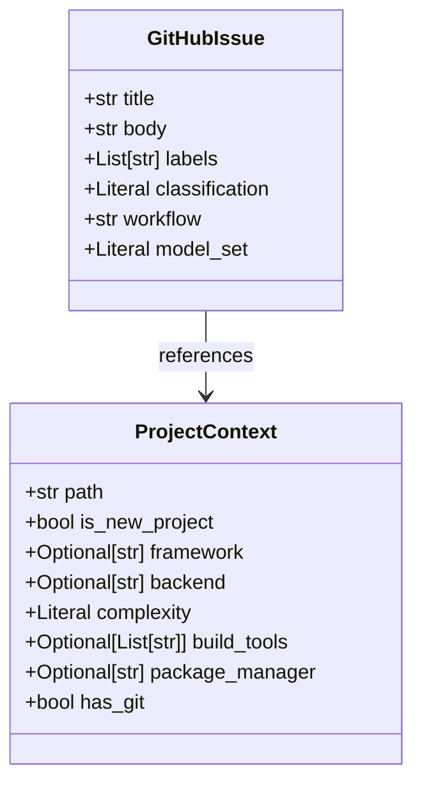

# Natural Language Processing Architecture

## High-Level Overview

The NL Processing system is a modular pipeline that converts natural language descriptions into structured, actionable GitHub issues with automatic ADW workflow recommendations. The system consists of five core components that work together to analyze user intent, detect project context, format issues, and integrate with GitHub.

### Key Design Principles

1. **Modularity**: Each component has a single, well-defined responsibility
2. **Testability**: All external dependencies are mockable for deterministic testing
3. **Extensibility**: Easy to add new frameworks, workflows, or LLM providers
4. **Robustness**: Comprehensive error handling and validation
5. **User Experience**: Rich terminal previews and interactive confirmation

---

## Component Architecture

### Component Diagram



### Component Responsibilities

| Component | Responsibility | Dependencies |
|-----------|---------------|--------------|
| **nl_processor** | Intent analysis, requirement extraction, orchestration | Claude API, data_models |
| **issue_formatter** | Template-based issue formatting | data_models |
| **project_detector** | Framework detection, complexity calculation | data_models |
| **github_poster** | GitHub CLI integration, terminal preview | GitHub CLI, data_models |
| **data_models** | Data validation and serialization | Pydantic |

---

## Data Flow Architecture

### Complete Pipeline Flow



### Step-by-Step Data Flow

1. **User Input**
   - Input: Natural language string (e.g., "Add dark mode toggle")
   - Output: Passed to project detector and NL processor

2. **Detect Project Context** (`project_detector.py`)
   - Input: Project path
   - Processing: File system analysis, pattern matching
   - Output: `ProjectContext` object with framework, complexity, tools

3. **Analyze Intent** (`nl_processor.py`)
   - Input: Natural language string
   - Processing: Claude API call with structured prompt
   - Output: Dict with `intent_type`, `summary`, `technical_area`

4. **Extract Requirements** (`nl_processor.py`)
   - Input: Natural language string + intent dict
   - Processing: Claude API call to extract actionable requirements
   - Output: List of requirement strings

5. **Classify Issue Type** (`nl_processor.py`)
   - Input: Intent dict
   - Processing: Simple mapping from `intent_type`
   - Output: "feature", "bug", or "chore"

6. **Suggest Workflow** (`nl_processor.py`)
   - Input: Issue type + project complexity
   - Processing: Rule-based workflow recommendation
   - Output: Tuple of (workflow_name, model_set)

7. **Generate Issue** (`nl_processor.py`)
   - Input: All previous outputs
   - Processing: Assemble `GitHubIssue` object
   - Output: Complete `GitHubIssue` with title, body, labels, workflow

8. **Format Preview** (`github_poster.py`)
   - Input: `GitHubIssue` object
   - Processing: Rich markdown formatting
   - Output: Formatted preview string

9. **User Confirmation** (Interactive)
   - Input: Preview display
   - Processing: User input (y/n)
   - Output: Boolean confirmation

10. **Post to GitHub** (`github_poster.py`)
    - Input: `GitHubIssue` object
    - Processing: `gh issue create` command
    - Output: Issue number

---

## Detailed Component Design

### 1. nl_processor Module

**Purpose:** Orchestrates the NL-to-issue conversion pipeline using Claude API.



**Key Functions:**
- `analyze_intent()` - Uses Claude to determine intent type and technical area
- `extract_requirements()` - Uses Claude to break down requirements
- `classify_issue_type()` - Maps intent to issue classification
- `suggest_adw_workflow()` - Recommends workflow based on type and complexity
- `process_request()` - Main orchestrator function

**Claude API Integration:**
- Model: `claude-sonnet-4-0`
- Temperature: 0.1 for intent, 0.2 for requirements
- Max tokens: 300 for intent, 500 for requirements
- JSON response parsing with markdown cleanup

### 2. issue_formatter Module

**Purpose:** Template-based formatting for different issue types.



**Templates:**
- **Feature**: Description, Requirements, Technical Approach, Workflow
- **Bug**: Description, Steps to Reproduce, Expected vs Actual, Workflow
- **Chore**: Description, Tasks, Workflow

**Key Functions:**
- `format_issue()` - Applies appropriate template
- `validate_issue_body()` - Ensures required sections exist
- `format_requirements_list()` - Converts list to bullet points
- `create_feature_issue_body()` - Convenience function for features
- `create_bug_issue_body()` - Convenience function for bugs
- `create_chore_issue_body()` - Convenience function for chores

### 3. project_detector Module

**Purpose:** Analyzes project structure to detect framework, tools, and complexity.



**Detection Strategy:**
- **Frameworks**: Checks `package.json`, `vite.config.*`, `pyproject.toml`
- **Build Tools**: Looks for config files (`webpack.config.js`, `tsconfig.json`, etc.)
- **Package Managers**: Checks lockfiles (`package-lock.json`, `uv.lock`, etc.)
- **Complexity**: Calculates score based on file count, frameworks, tools, monorepo structure

**Supported Technologies:**
- Frontend: React, Vue, Next.js, Angular, Svelte
- Backend: FastAPI, Django, Flask, Express, NestJS, Fastify
- Build Tools: Vite, Webpack, Rollup, TypeScript, Babel, Docker
- Package Managers: npm, yarn, pnpm, bun, pip, uv, poetry, pipenv

### 4. github_poster Module

**Purpose:** GitHub CLI integration with rich terminal previews.



**Key Functions:**
- `format_preview()` - Creates rich markdown preview
- `post_issue()` - Posts via gh CLI with confirmation
- `_validate_gh_cli()` - Checks gh installation and auth
- `_execute_gh_command()` - Wraps gh CLI commands
- `get_repo_info()` - Fetches repository information

**GitHub CLI Integration:**
- Commands: `gh issue create`, `gh auth status`, `gh repo view`
- Rich library for terminal formatting
- Interactive confirmation prompts

### 5. data_models Module

**Purpose:** Pydantic models for data validation and serialization.



**Models:**
- **GitHubIssue**: Represents a complete GitHub issue
- **ProjectContext**: Represents detected project information

**Validation:**
- Pydantic automatically validates types
- Literal types enforce allowed values
- Optional fields handle missing data gracefully

---

## Integration Points

### 1. Anthropic Claude API Integration

**Purpose:** Natural language understanding and requirement extraction.

**Configuration:**
- API Key: `ANTHROPIC_API_KEY` environment variable
- Endpoint: `https://api.anthropic.com` (configurable)
- Model: `claude-sonnet-4-0`

**Request Pattern:**
```python
client = Anthropic(api_key=os.environ.get("ANTHROPIC_API_KEY"))
response = client.messages.create(
    model="claude-sonnet-4-0",
    max_tokens=300,
    temperature=0.1,
    messages=[{"role": "user", "content": prompt}]
)
```

**Error Handling:**
- API key validation
- Rate limiting with exponential backoff
- JSON parsing with markdown cleanup
- Exception wrapping with context

### 2. GitHub CLI Integration

**Purpose:** Posting issues and repository interaction.

**Requirements:**
- GitHub CLI installed (`gh`)
- Authenticated with GitHub (`gh auth login`)
- Write access to target repository

**Command Pattern:**
```bash
gh issue create \
  --title "Issue Title" \
  --body "Issue Body" \
  --label "label1,label2" \
  --repo owner/repo
```

**Validation:**
- Check `gh --version` for installation
- Check `gh auth status` for authentication
- Capture and parse command output
- Extract issue number from URL

### 3. FastAPI Backend Integration (Future)

**Planned Endpoints:**
```
POST /api/nl/process
GET /api/nl/preview/{request_id}
POST /api/nl/confirm/{request_id}
GET /api/projects/{project_id}/context
```

### 4. CLI Interface Integration

**Current Usage:**
```bash
# Interactive mode
tac-webbuilder nl-process "Add dark mode"

# Non-interactive mode
tac-webbuilder nl-process "Add dark mode" --project . --no-confirm
```

---

## Design Decisions and Rationale

### 1. Why Claude API for Intent Analysis?

**Decision:** Use Anthropic's Claude API instead of OpenAI or local models.

**Rationale:**
- **Accuracy**: Claude excels at structured output and following instructions
- **JSON Parsing**: Reliable JSON formatting in responses
- **Context Window**: Large context for complex requirements
- **Cost-Effectiveness**: Good balance of cost and quality

**Trade-offs:**
- Dependency on external API (requires internet connection)
- API costs (mitigated by caching and reasonable token limits)
- Single provider lock-in (could add OpenAI fallback in future)

### 2. Template-Based vs Generated Formatting

**Decision:** Use static templates with variable substitution.

**Rationale:**
- **Consistency**: Ensures all issues follow the same format
- **Predictability**: No LLM variance in formatting
- **Performance**: Fast template rendering without API calls
- **Maintainability**: Easy to update templates

**Trade-offs:**
- Less flexible than fully generated content
- Requires template maintenance for new issue types
- Limited customization per request

### 3. Complexity Calculation Algorithm

**Decision:** Use rule-based scoring system for complexity.

**Formula:**
```
complexity_score = 0
+ (2 if file_count > 100 else 1 if file_count > 50 else 0)
+ (1 if has_framework else 0)
+ (1 if has_backend else 0)
+ (1 if len(build_tools) > 2 else 0)
+ (2 if is_monorepo else 0)

complexity = "high" if score >= 5 else "medium" if score >= 3 else "low"
```

**Rationale:**
- **Transparent**: Clear rules for complexity determination
- **Tunable**: Easy to adjust thresholds and weights
- **Fast**: No LLM calls needed
- **Consistent**: Deterministic results

**Trade-offs:**
- May not capture all complexity factors
- Heuristic-based (not ML-trained)
- Requires manual tuning for edge cases

### 4. Workflow Recommendation Logic

**Decision:** Use simple if-else rules based on issue type and complexity.

**Rules:**
```python
if issue_type == "bug":
    return ("adw_plan_build_test_iso", "base")
elif issue_type == "chore":
    return ("adw_sdlc_iso", "base")
else:  # feature
    if complexity == "high":
        return ("adw_plan_build_test_iso", "heavy")
    elif complexity == "medium":
        return ("adw_plan_build_test_iso", "base")
    else:
        return ("adw_sdlc_iso", "base")
```

**Rationale:**
- **Simple**: Easy to understand and maintain
- **Effective**: Covers common scenarios well
- **Overridable**: Users can customize if needed

**Trade-offs:**
- May not be optimal for all scenarios
- Doesn't learn from past workflow performance
- Could benefit from ML-based recommendations in future

---

## Extension Points

### 1. Adding New Frameworks

To add support for a new framework:

1. Update `detect_framework()` in `project_detector.py`:
   ```python
   # Check for new-framework
   if (path / "new-framework.config.js").exists():
       return "new-framework"
   ```

2. Add framework to type hints in `ProjectContext`:
   ```python
   framework: Optional[Literal["react-vite", ..., "new-framework"]]
   ```

3. Update tests to include new framework detection

### 2. Custom Workflow Strategies

To add custom workflow recommendation logic:

1. Create a new function in `nl_processor.py`:
   ```python
   def custom_workflow_strategy(issue_type, complexity, context):
       # Custom logic here
       return (workflow, model_set)
   ```

2. Replace `suggest_adw_workflow()` call in `process_request()`:
   ```python
   workflow, model_set = custom_workflow_strategy(
       classification, project_context.complexity, project_context
   )
   ```

### 3. Alternative LLM Providers

To add OpenAI or other LLM providers:

1. Create provider abstraction:
   ```python
   class LLMProvider(ABC):
       @abstractmethod
       async def analyze_intent(self, nl_input: str) -> dict:
           pass

       @abstractmethod
       def extract_requirements(self, nl_input: str, intent: dict) -> List[str]:
           pass
   ```

2. Implement provider classes:
   ```python
   class ClaudeProvider(LLMProvider):
       # Current implementation

   class OpenAIProvider(LLMProvider):
       # OpenAI implementation
   ```

3. Use provider in `process_request()`:
   ```python
   provider = get_provider()  # Factory function
   intent = await provider.analyze_intent(nl_input)
   ```

### 4. Custom Issue Templates

To add custom issue templates:

1. Add template to `ISSUE_TEMPLATES` in `issue_formatter.py`:
   ```python
   ISSUE_TEMPLATES["epic"] = """# {title}

   ## Epic Description
   {description}

   ## User Stories
   {user_stories}

   ## Acceptance Criteria
   {acceptance_criteria}

   ## Workflow
   {workflow}
   """
   ```

2. Add corresponding factory function:
   ```python
   def create_epic_issue_body(...):
       # Implementation
   ```

### 5. Machine Learning Enhancements

Future ML-based improvements:

1. **Workflow Recommendation**:
   - Train model on historical workflow outcomes
   - Use project features + issue features to predict best workflow

2. **Complexity Prediction**:
   - Use neural network to predict complexity from project structure
   - Learn from developer feedback on complexity accuracy

3. **Requirement Quality**:
   - Score requirement extraction quality
   - Fine-tune prompts based on feedback

---

## Performance Considerations

### Latency Analysis

| Operation | Typical Latency | Bottleneck |
|-----------|----------------|------------|
| `detect_project_context()` | 100-500ms | File I/O |
| `analyze_intent()` | 1-2s | Claude API call |
| `extract_requirements()` | 1-3s | Claude API call |
| `post_issue()` | 500ms-1s | GitHub CLI |
| **Total Pipeline** | **3-7s** | Claude API calls |

### Optimization Strategies

1. **Caching**:
   ```python
   @lru_cache(maxsize=100)
   def detect_project_context(path: str) -> ProjectContext:
       # Implementation
   ```

2. **Parallel API Calls**:
   ```python
   intent_task = asyncio.create_task(analyze_intent(nl_input))
   context_task = asyncio.create_task(detect_project_context(path))
   intent, context = await asyncio.gather(intent_task, context_task)
   ```

3. **Request Batching**:
   ```python
   # Process multiple requests in batch
   intents = await asyncio.gather(*[
       analyze_intent(req) for req in requests
   ])
   ```

---

## Security Considerations

### API Key Management

- ✅ Environment variables (not hardcoded)
- ✅ Never logged or displayed
- ❌ Consider secrets management service for production

### Input Validation

- ✅ Pydantic models validate all inputs
- ✅ Path traversal protection in project detector
- ✅ Command injection protection in GitHub poster

### Rate Limiting

- ⚠️ No built-in rate limiting (implement exponential backoff)
- ⚠️ No request throttling (could add queue system)

### Data Privacy

- ⚠️ Natural language input sent to Claude API
- ⚠️ Consider on-premise LLM for sensitive projects
- ✅ No data stored persistently (stateless processing)

---

## Testing Strategy

### Unit Testing

Each module has comprehensive unit tests with mocked dependencies:

```python
# Example: Mocking Claude API
@pytest.mark.asyncio
async def test_analyze_intent(mock_anthropic):
    mock_anthropic.messages.create.return_value.content[0].text = """
    {
        "intent_type": "feature",
        "summary": "Add dark mode",
        "technical_area": "UI"
    }
    """
    result = await analyze_intent("Add dark mode")
    assert result["intent_type"] == "feature"
```

### Integration Testing

End-to-end tests validate the complete pipeline:

```python
@pytest.mark.integration
async def test_full_nl_to_issue_pipeline(tmp_project):
    context = detect_project_context(tmp_project)
    issue = await process_request("Add feature X", context)
    assert issue.title
    assert issue.body
    assert issue.workflow
```

### Test Coverage

- **Unit Tests**: 40+ test cases across 5 test files
- **Integration Tests**: 10+ end-to-end scenarios
- **Mocked Dependencies**: All external APIs mocked
- **Coverage Target**: >90% for core modules

---

## Future Enhancements

### Short-term (Next 3 Months)

1. **OpenAI Fallback**: Add OpenAI as backup LLM provider
2. **Workflow Analytics**: Track workflow outcomes and optimize recommendations
3. **Template Customization**: Allow users to define custom templates
4. **Batch Processing**: Support multiple requests in one API call

### Medium-term (3-6 Months)

1. **Web UI Integration**: Full browser-based interface
2. **Learning System**: ML-based workflow recommendations
3. **Multi-language Support**: Process requests in multiple languages
4. **Advanced Caching**: Redis-based caching for project contexts

### Long-term (6-12 Months)

1. **On-premise LLM**: Support for local LLM deployment
2. **Custom Workflows**: User-defined ADW workflows
3. **IDE Extensions**: VSCode and JetBrains plugins
4. **Advanced Analytics**: Dashboard for issue quality metrics

---

## Conclusion

The NL Processing architecture is designed to be modular, extensible, and maintainable. Each component has a clear responsibility and well-defined interfaces. The system leverages best-in-class tools (Claude API, GitHub CLI, Pydantic) while maintaining testability through dependency injection and mocking.

The architecture supports future growth through extension points for new frameworks, LLM providers, and workflow strategies. Performance is optimized through caching and parallel processing, while security is maintained through proper input validation and API key management.

For more details on specific components, see:
- [API Reference](../api/nl-processing.md)
- [Usage Guide](../guides/nl-processing-guide.md)
- [Examples](../../examples/nl-processing/README.md)
